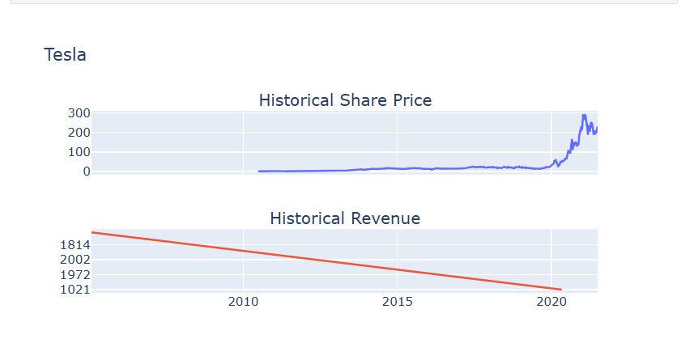
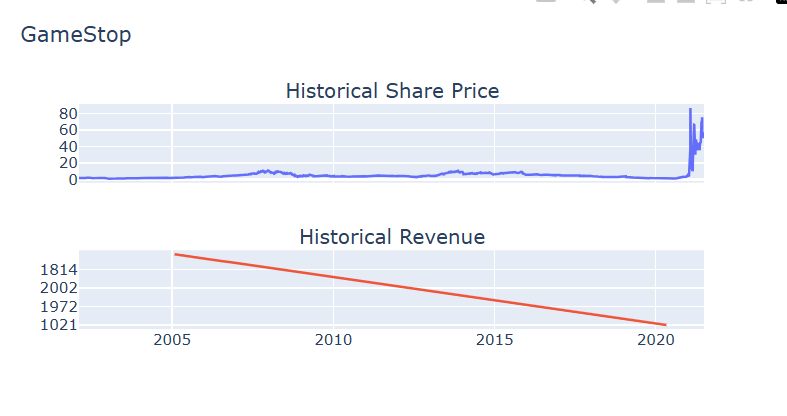

# 📈 IBM Stock Analysis Dashboard

## 📌 Project Overview
This project analyzes the historical stock prices and revenue of Tesla and GameStop using Python. It demonstrates data extraction, web scraping, data cleaning, and interactive data visualization techniques.

## 🚀 Features
- Extract historical stock data using `yfinance`
- Scrape revenue data using `BeautifulSoup`
- Clean and preprocess financial datasets with `Pandas`
- Visualize stock price and revenue trends using `Plotly`
- Compare stock performance with company revenue

## 🛠 Technologies Used
- Python
- Pandas
- BeautifulSoup
- yfinance
- Plotly
- Jupyter Notebook

## 📊 Dashboard Preview

### Tesla Stock & Revenue Dashboard


### GameStop Stock & Revenue Dashboard


## 📂 Project Structure

```
IBM-Stock-Analysis-Dashboard/
│── IBM_Stock_Analysis_Dashboard.ipynb
│── tesla_stock_revenue_dashboard.png
│── gamestop_stock_revenue_dashboard.png
└── README.md
```

## 🎯 Skills Demonstrated
- Data Collection
- Web Scraping
- Data Cleaning
- Data Visualization
- Financial Data Analysis
- Python Programming

## 👩‍💻 Author

**Arpita Tidme**

---

⭐ If you found this project interesting, feel free to explore the repository!

